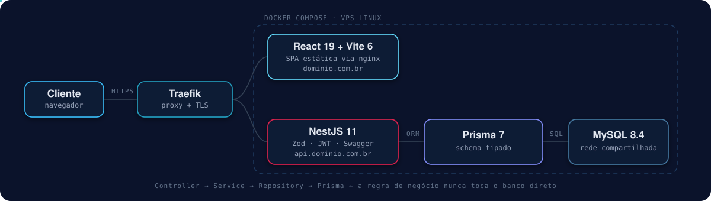

<picture>
  <source media="(prefers-color-scheme: dark)" srcset="./header-dark.svg">
  <source media="(prefers-color-scheme: light)" srcset="./header-light.svg">
  
</picture>

<div align="center">

[](https://bevilabs.com.br)
[](https://www.linkedin.com/in/julio-bevi)
[](mailto:juliobevi1@gmail.com)

</div>

<picture>
  <source media="(prefers-color-scheme: dark)" srcset="./sobre-dark.svg">
  <source media="(prefers-color-scheme: light)" srcset="./sobre-light.svg">
  
</picture>

---

## Arquitetura padrão

Não escrevo sistemas soltos. Os projetos abaixo compartilham **a mesma arquitetura, o mesmo
pipeline de deploy e as mesmas convenções** — o que torna cada novo sistema previsível de
construir e barato de manter.

<picture>
  <source media="(prefers-color-scheme: dark)" srcset="./arquitetura-dark.svg">
  <source media="(prefers-color-scheme: light)" srcset="./arquitetura-light.svg">
  
</picture>

```text
Controller  →  Service  →  Repository  →  Prisma  →  MySQL
   HTTP        regra de     acesso a      query      dados
   + Zod       negócio       dados       tipada
```

Cada camada tem uma responsabilidade única. O `Controller` valida com **Zod** e não conhece o
banco; o `Repository` conhece o banco e não conhece HTTP. Isso mantém a regra de negócio testável
sem subir infraestrutura.

---

## Stack

<table>
<tr><th align="left">Camada</th><th align="left">Tecnologias</th></tr>

<tr><td><b>Backend</b></td><td>


</td></tr>

<tr><td><b>Frontend</b></td><td>


</td></tr>

<tr><td><b>Dados</b></td><td>


</td></tr>

<tr><td><b>Infra &amp; Deploy</b></td><td>


</td></tr>

<tr><td><b>Qualidade</b></td><td>


</td></tr>

</table>

---

## Projetos em destaque

<table>
<tr>

<td width="50%" valign="top">

### 🏭 [Atlas Stock](https://github.com/BevilacquaJulio/atlas_stock)

ERP para empresas de **blindagem automotiva**. Centraliza compras, estoque,
projetos por veículo, consumo de materiais e movimentações financeiras.

Autenticação com *access* + *refresh token*, controle de acesso por função,
exclusão lógica e checklist de status por projeto.

`NestJS 11` `React 19` `Prisma 7` `Tailwind 4` `Docker`

</td>
<td width="50%" valign="top">

### 📋 [Change Tracker](https://github.com/BevilacquaJulio/change_tracker)

Rastreamento de **itens de mudança** em projetos web — bugs, melhorias e
implementações — com evidências visuais, auditoria e colaboração multiprojeto.

**Reescrito de FastAPI + vanilla para NestJS + React** mantendo banco, regras
de negócio e interface idênticos. Zero regressão visual.

`NestJS 11` `React 19` `Prisma 7` `Vitest` `Docker`

</td>
</tr>
<tr>

<td width="50%" valign="top">

### 🌐 [Bevilabs Portfólio](https://github.com/BevilacquaJulio/bevilabs_portfolio)

Portfólio construído como **sistema real de ponta a ponta**, não como página
estática: API própria, banco e painel de administração.

Em produção sob **Traefik**, com API e frontend em containers separados
compartilhando instância MySQL.

`NestJS 11` `React 18` `Prisma 7` `Traefik` `Nginx`

</td>
<td width="50%" valign="top">

### 💰 [Financeiro](https://github.com/BevilacquaJulio/financeiro)

Controle financeiro pessoal com categorização de lançamentos, relatórios e
fechamento por período.

API e SPA em containers independentes atrás do Traefik, usando o MySQL
compartilhado da infraestrutura.

`NestJS 11` `React 18` `Prisma 7` `Docker` `Traefik`

</td>
</tr>
</table>

<div align="center">

[](https://github.com/BevilacquaJulio/controle_pagamento)
[](https://github.com/BevilacquaJulio/Formula1)

</div>

---

## De onde eu venho

Comecei em **Python/FastAPI** e **PHP**, com frontends em HTML/CSS/JS puro. Ao longo de 2026
migrei essa base para **NestJS + React/Vite + Prisma**, um sistema por vez, com um requisito
inegociável: *nenhuma mudança de comportamento visível para o usuário*.

Em vários casos o CSS original foi movido intacto e a marcação reproduzida classe por classe —
migrar stack sem quebrar a experiência de quem usa é uma restrição bem mais dura do que
reescrever do zero, e foi ela que definiu a arquitetura que uso hoje.

---

## Estatísticas

<div align="center">


</div>

---

<div align="center">

### Vamos conversar

[](https://bevilabs.com.br)
[](https://www.linkedin.com/in/julio-bevi)
[](mailto:juliobevi1@gmail.com)

</div>
